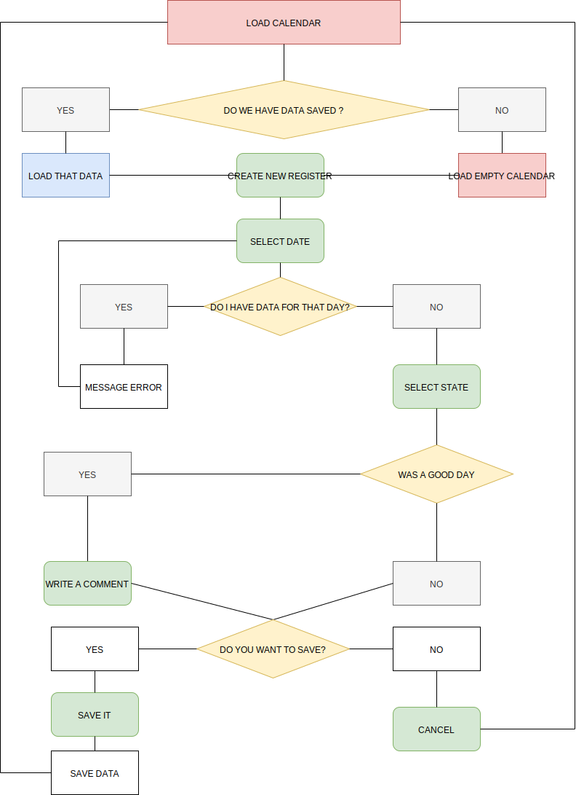

# Exercise Formación Online de Adalab by Eva Marco

This project was bootstrapped with [Create React App](https://github.com/facebook/create-react-app).

##  👩‍🔧️ How to start

Clone online repository from [this link](https://github.com/Adalab/formacion-online-life-calendar-evamarco).
To install all dependences run `npm install`.

## 👣️ 👣  Step  by Step️

This are my step by step instructios on how I made this project. 

1. I start by reading my specifications. 
  You can read them [here](https://books.adalab.es/materiales-front-end-g/formacion-online/3_prueba_tecnica).
  There were some important notes from this exercise:
      - You only have two options (Good Day  or Bad Day).
      - You can Add a message only in Good Days.
      - When you save the Day you can not edit it.
      - We have to save our data in our Local Storage. 
      - I don't have to manage calendar options. 

2. How I plan the exercise. 
  I made a flowchart to know exactly how I want my app to Work. 

  

3. Start creating the different components.
  For my first step I need two basic components.
  - Calendar.
  - Day editor. 
  
4. Create basic function.  
  I install HashRouter so I can change from one page to another. From calendar to Day Edit and viceversa. 
  I create a link to Edit in my calendar.
  The link in Edit to calendar in my first step is in cancel btn. 

5. Then I create the initial functions.
   1. getDate -> To get the date the user choose. (In this point I'm not checking if its a viable date).
   2. getState -> If is Happy or Sad.
      1. If it's a happy day you can see text area.
   3. getMsg -> To get the happy message.  
      1. If its a sad day, I set msg to empty. 
   
  All these funcions save the return result in the state. When I press create, I get this data from the state an create an object and clean those gaps in state. 
  I push this object to an array and save it in the local Storage. 

## 💻️ Available Scripts

In the project directory, you can run:

### `npm start`

Runs the app in the development mode. 
Open [http://localhost:3000](http://localhost:3000) to view it in the browser.

The page will reload if you make edits. 
You will also see any lint errors in the console.

### `npm run build`

Builds the app for production to the `build` folder. 
It correctly bundles React in production mode and optimizes the build for the best performance.

The build is minified and the filenames include the hashes. 
Your app is ready to be deployed!

See the section about [deployment](https://facebook.github.io/create-react-app/docs/deployment) for more information.

### `npm run eject`

**Note: this is a one-way operation. Once you `eject`, you can’t go back!**

If you aren’t satisfied with the build tool and configuration choices, you can `eject` at any time. This command will remove the single build dependency from your project.

Instead, it will copy all the configuration files and the transitive dependencies (Webpack, Babel, ESLint, etc) right into your project so you have full control over them. All of the commands except `eject` will still work, but they will point to the copied scripts so you can tweak them. At this point you’re on your own.

You don’t have to ever use `eject`. The curated feature set is suitable for small and middle deployments, and you shouldn’t feel obligated to use this feature. However we understand that this tool wouldn’t be useful if you couldn’t customize it when you are ready for it.

## Learn More

You can learn more in the [Create React App documentation](https://facebook.github.io/create-react-app/docs/getting-started).

To learn React, check out the [React documentation](https://reactjs.org/).

